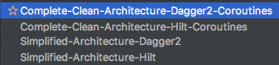

This is the main branch of the **'Checkout & Code'** templates developed in order to facilitate the foundation work applied in the beginning of any project.

## Getting Started :vertical_traffic_light:

Select one of the available options, depending on the project requirement:

Follow the instructions in the README file of the concrete branch. Enjoy! :surfer:

## Next Available Templates :soon:

- Complete Clean Code **MVVM** + **Dagger2** + **RXJava**
- Complete Clean Code **MVVM** + **Hilt** + **RXJava**
- Complete Clean Code **MVI** + **Dagger2** + **RXJava**
- Complete Clean Code **MVI** + **Hilt** + **RXJava**

#  License :oncoming_police_car:

    Copyright 2020 Fernando Prieto Moyano

    Licensed under the Apache License, Version 2.0 (the "License");
    you may not use this file except in compliance with the License.
    You may obtain a copy of the License at

       http://www.apache.org/licenses/LICENSE-2.0

    Unless required by applicable law or agreed to in writing, software
    distributed under the License is distributed on an "AS IS" BASIS,
    WITHOUT WARRANTIES OR CONDITIONS OF ANY KIND, either express or implied.
    See the License for the specific language governing permissions and
    limitations under the License.